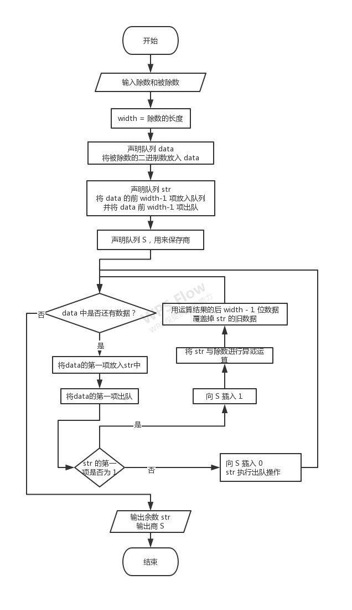
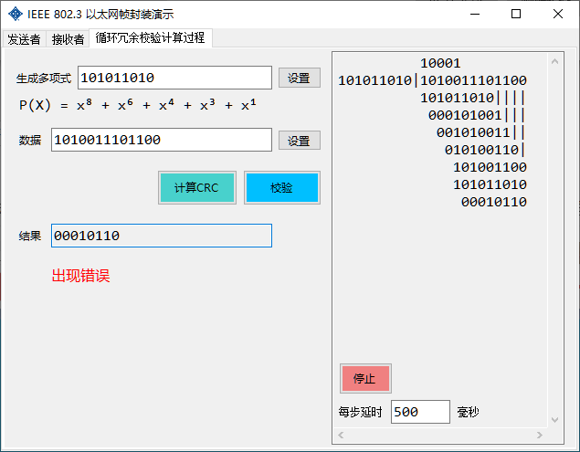
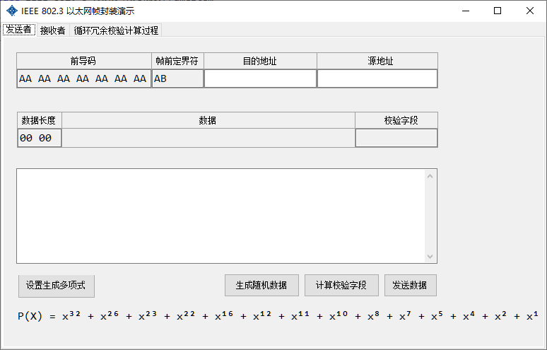
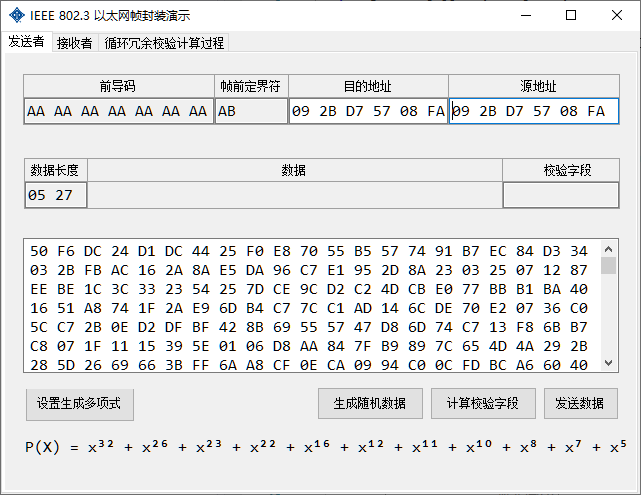
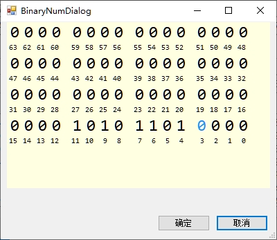
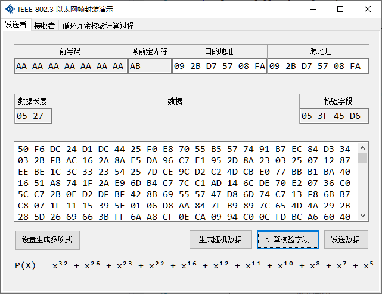
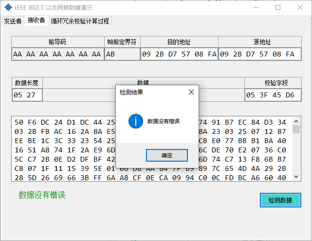
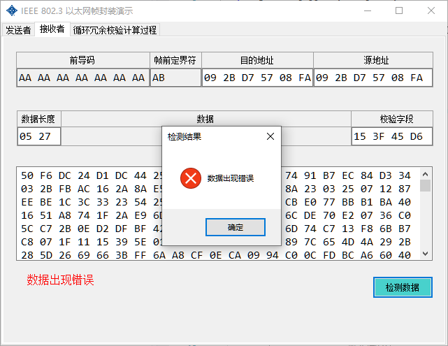
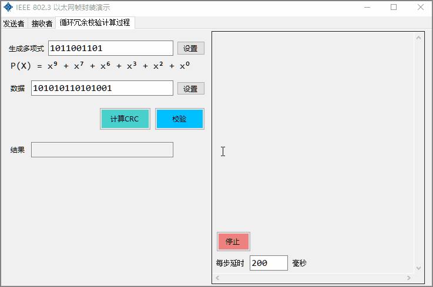

# IEEE 802.3 以太网帧封装

## 题目

### IEEE 802.3以太网帧封装

 编写程序实现IEEE 802.3以太网帧封装。

#### 基本要求：

1. 要求画出界面，以太网帧的数据部分、源MAC地址和目的MAC地址均从界面输入；

2. 计算后的校验和字段和封装后的结果可以从界面上输出；

3. 生成多项式G（X）=X8+X2+X+1； 

4. 使用的操作系统、语言和编译环境不限，但必须在报告中注明。

#### 扩展要求：

1. 能够实现CRC计算过程的可视化；

2. 能够从界面上控制程序的运行。

#### 相关理论知识

按802.3标准的帧结构如下表所示（802.3标准的Ethernet帧结构由7部分组成）

802.3标准的帧结构

| 前导码 | 帧前定界符 | 目的地址 | 源地址 | 长度字段 | 数据字段   | 校验字段 |
| ------ | ---------- | -------- | ------ | -------- | ---------- | -------- |
| 7B     | 1B         | (6B)     | (6B)   | (2B)     | (长度可变) | (4B)     |

其中，帧数据字段的最小长度为46B。如果帧的LLC数据少于46B，则应将数据字段填充至46B。填充字符是任意的，不计入长度字段值中。

在校验字段中，使用的是CRC校验。校验的范围包括目的地址字段、源地址字段、长度字段、LLC数据字段。

## 需求分析

### 用户输入模块可视化

使用可视化的界面，接收用户输入的目的地址、源地址、长度字段、数据字段。并且支持生成随机数据，这样可以减少用户输入

### 按比特计算校验字段

利用生成多项式，计算待校验数据的校验字段。其中待校验字段为整数个字节，生成多项式的阶不超过32，计算出的余数为4个字节

### 输入二进制数可视化

模仿Windows 10计算器的bit输入键盘，让用户可以通过点击鼠标即可输入生成多项式等数据

### 对帧数据进行校验

将计算FCS后的帧发生给接收者，接收者可以校验是否出错。可以模拟出错，比如手动修改数据，然后再校验是否出错。

### CRC计算过程的可视化

使用较短的二进制数据，动态显示CRC的计算过程，并支持校验功能。可以自定义每一步的延迟时间来控制显示速度，并可以随时停止演示。

## 循环冗余码计算

### 原理

根据以下公式

$$
r ≡ (n * c + r) \mod c\\
$$

可以得到

$$
110 ≡ (10010101 + 110) \mod m\\
≡ (10010101000000 + 110) \mod m\\
≡ 10010101000110 \mod m
$$

即，将一个数扩大n倍，然后再加上余数，此时$$\mod  m$$ 的余数不变

### 流程图



### 代码实现

```c#
private byte[] CalcCRC(string v)
{
    var data = new Queue<char>(v.ToArray());    // 被除数
    char[] divisor = binaryString.ToArray();    // 除数
    Queue<char> S = new Queue<char>();          // 商
    int width = divisor.Length;                 // 每次取 width 个字符进行异或运算
    Queue<char> str = new Queue<char>();        // 每次取的长度为 width 的部分被除数

    // 获取前 width - 1 个字符，填入到str中
    for (int i = 0; i < width - 1; i++)
    {
        str.Enqueue(data.Dequeue());
    }

    while (data.Count != 0)
    {
        str.Enqueue(data.Dequeue());

        if (str.First() == '0')
        {
            S.Enqueue('0');
            str.Dequeue();
        }
        else
        {
            S.Enqueue('1');

            var temp = str.ToArray();
            str.Clear();

            for (int i = 1; i < temp.Length; i++)
            {
                str.Enqueue(temp[i] == divisor[i] ? '0' : '1');
            }
        }
    }
	// 计算已经结束，str中的值就是结果，下面的代码可以不用看了
    
    // 将str中的值转成4个字节的二进制数组
    var res = new string(str.ToArray()).PadLeft(32, '0');
    var result = new byte[4];
    // 将字符串格式化为byte
    for (int i = 0; i < 4; i++)
    {
        result[i] = Convert.ToByte(res.Substring(i * 8, 8), 2);
    }

    return result;
}
```

### 举例应用

待处理数据：1010 0111 0110 0

生成多项式：1010 1101 0	($$P(x) = x^8 + x^6 + x^4 + x^3 + x^1$$)

1. 将待处理数据全部放入队列 `data` 中

   ```
   data = [1010011101100]
   ```

2. 生成多项式共 `9` 位，所以先让队列 `data` 的前 `8` 项出队，并将数据放入队列 `str` 中

   ```
   str  = [10100111]
   data = [01100]
   ```

3. 队列 `data.Count = 5` != 0，继续执行

   1. 将队列 `data` 的第项出队，并放入队列 `str` 中

      ```
      str  = [101001110]
      data = [1100]
      ```

   2. `str` 的第一个元素是`1`

      1. 向列 `S` 中插入 `1`

      2. 将队列 `str` 的值和生成多项式的值进行按位异或，并将结果的后`8`个字符复制给 `str`
         101001110 ^ 101011010 = 000010100

         ```
         S    = [1]
         str  = [00010100]
         data = [1100]
         ```

4. 队列 `data.Count = 4` != 0，继续执行
   1. 将队列 `data` 的第一项出队，并放入队列 `str` 中

      ```
      S    = [1]
      str  = [000101001]
      data = [100]
      ```
      
   2. `str` 的第一个元素是`0`
   
      1. 向列 `S` 中插入 `0`，并让 `str` 的第一项出队
   
          ```
           S    = [10]
           str  = [00101001]
           data = [100]
          ```
   
4. 队列 `data.Count = 3` != 0，继续执行
   1. 将队列 `data` 的第一项出队，并放入队列 `str` 中

      ```
      S    = [10]
      str  = [001010011]
      data = [00]
      ```
      
   2. `str` 的第一个元素是`0`
   
      1. 向列 `S` 中插入 `0`，并让 `str` 的第一项出队
   
          ```
           S    = [100]
           str  = [01010011]
           data = [00]
          ```
   
4. 队列 `data.Count = 2` != 0，继续执行
   1. 将队列 `data` 的第一项出队，并放入队列 `str` 中

      ```
      S    = [100]
      str  = [010100110]
      data = [0]
      ```
      
   2. `str` 的第一个元素是`0`
   
      1. 向列 `S` 中插入 `0`，并让 `str` 的第一项出队
   
          ```
           S    = [1000]
           str  = [10100110]
           data = [0]
          ```
   
7. 队列 `data.Count = 1` != 0，继续执行

   1. 将队列 `data` 的第项出队，并放入队列 `str` 中

      ```
       S    = [1000]
       str  = [101001100]
       data = []
      ```

   2. `str` 的第一个元素是`1`

      1. 向列 `S` 中插入 `1`

      2. 将队列 `str` 的值和生成多项式的值进行按位异或，并将结果的后`8`个字符复制给 `str`
         101001100 ^ 101011010 = 000010110

         ```
         S    = [10001]
         str  = [00010110]
         data = []
         ```

8. 队列 `data.Count = 0` == 0，结束，余数为 `str = 00010110`，商为`S = 10001`

9. 整个计算过程为：

   

## 效果

- 打开程序



- 生成随机数据



- 设置生成多项式（不自己设置推荐，因为自己设置的生成多项式可能不合适，从而提高校验错误率）



- 计算校验字段



- 发送数据，检测数据



- 将数据进行改动（将校验字段05 3F 45 D6改成15 3F 45 D6），再检测数据



- 可视化循环冗余校验计算过程（延时可以自己设置）

